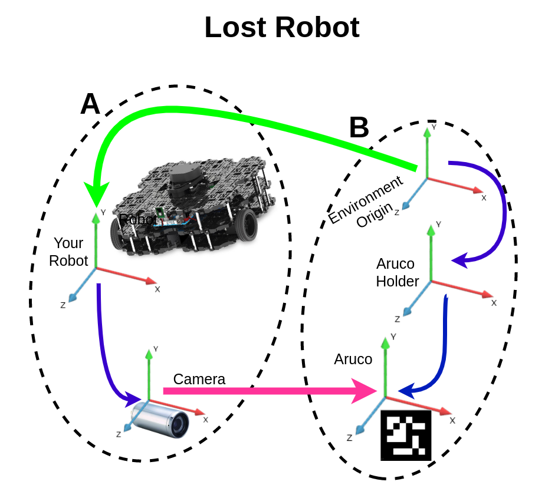
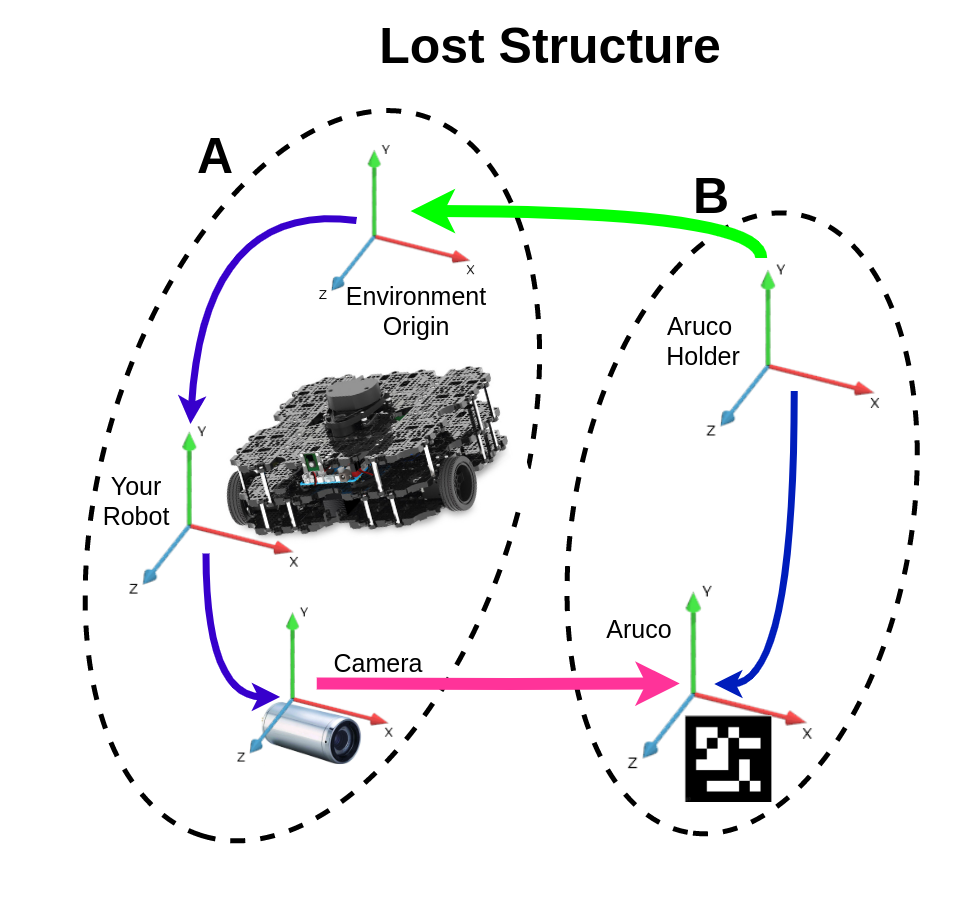
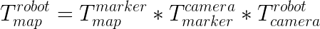
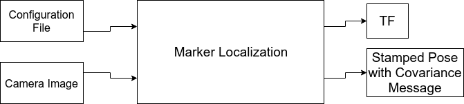

# BIR Marker Localization

Hello fellows!

Localization problem is one of the most commom in robotics. This package was made to help you find your robot. All you need is a camara and artificial markers!

"But I don't know what artificial markers are... :sob:'' No problem! Just look at [**THIS**](https://docs.opencv.org/trunk/d5/dae/tutorial_aruco_detection.html) or [**THIS**](https://docs.google.com/document/d/1QU9KoBtjSM2kF6ITOjQ76xqL7H0TEtXriJX5kwi9Kgc/edit) library description that we have used to develop this package.

## Localization Problem

There are two suggested ways to use this package. You can either try to locate your robot or a structure in the enviroment. There are below two graphics representation for these cases. The graph's arrows represents tf connections from parent to child. Blue arrows means known tfs, the pink arrow is the calculated tf using camera image and the green is the desired tf to be obtained. Despite the difference between each case, both use the same strategy, which is the tf tree connection. Since it is possible to obtain any tf between tree members, the only thing you need to do is to connect trees. This package uses cameras, arucos and opencv to obtain a tf between camera and aruco to link these A and B tree. With both tree linked, it is possible to know robot localization or the structure location in enviroment. Also, it is possible to obtain the pose from each aruco.





This package allows you to subscribe to a topic that publish the green arrow or actually connect the tf tree. These cases are just illustrations, you can also connect the green arrow in another way if you wish. Just remember that a children can only have one parent and a tree cannot have a loop.

<!-- {:height="36px" width="36px"}

 -->




## Getting Started

Before get your hands dirty, you'll need to install some stuff. Please follow the instalation guide and you'll be all set!
https://github.com/Brazilian-Institute-of-Robotics/bir_marker_localization.git
### Prerequisites

- #### [ROS](<http://wiki.ros.org/ROS/Installation>)

- #### [OpenCV 3.3.1](<https://docs.opencv.org/3.3.1/d7/d9f/tutorial_linux_install.html>)
From GitHub releases, download OpenCV source code [here](https://github.com/opencv/opencv/archive/3.3.1.tar.gz) and follow these steps:

- Create a temporary directory:
    ```sh
    cd ~/opencv
    tar -zxvf 3.3.1.tar.gz
    mkdir build
    cd build
    ```

- Run cmake:
    ```sh
    cmake -D CMAKE_BUILD_TYPE=Release -D CMAKE_INSTALL_PREFIX=/usr/local ..
    ```

- Build in several threads:
    ```sh
    make -j6 # runs 6 jobs in parallel.
    ```

- Install libraries:
    ```sh
    sudo make install
    ```

> Make sure that ROS is working with this OpenCV version, otherwise during compilation of older OpenCV the compiler will report it didn't find `cornerRefinementMethod`

### Installing

A step by step series of examples that tell you how to get a development env running

#### Download the Package

```sh
~/catkin_ws/src$ git clone -b develop https://github.com/Brazilian-Institute-of-Robotics/bir_marker_localization.git
```

#### Download the Package ROS Dependencies

```sh
~/catkin_ws$ rosdep install --from-paths src --ignore-src -r -y
```

#### Build the package

```sh
~/catkin_ws$ catkin build marker_localization
```

> If any error occurs here, build it again.

## How it works

### Set Configuration File

Inside config folder there is a default config file. It's possible create how many as needed.

Important: Some variable set are float, so make sure that in these cases you put a floating point.

> Example: params vector: [1.0, 2.0, 3.0]

Look up that 1.0 represents an integer 1.

#### Configuration Words

### Overall types and default values table camera_tf_name base_tf_name 

| Configuration Name:       | Type:            | Example Value:                            | Required param:     |
|---------------------------|------------------|-------------------------------------------|---------------------|
| debug                     | bool             | true                                      | :heavy_check_mark:  |
| pose_topic                | string           | pose                                      | :x:                 |
| enable_tf                 | bool             | true                                      | :x:                 |
| robot_as_parent           | bool             | true                                      | :x:                 |
| camera_tf_name            | string           | camera_rgb_optical_frame                  | :heavy_check_mark:  |
| map_tf_name               | string           | world                                     | :heavy_check_mark:  |
| base_tf_name              | string           | base_footprint                            | :heavy_check_mark:  |
| camera_matrix             | vector of double | [fx, 0.0, cx, 0.0, fy, cy, 0.0, 0.0, 1.0] | :heavy_check_mark:  |
| camera_distortion         | vector of double | [k1, k2, k3, k4, k5]                      | :x:                 |
| image_topic               | string           | /camera/rgb/image_raw                     | :heavy_check_mark:  |
| marker_dictionary         | int              | 11                                        | :heavy_check_mark:  |
| markers_length            | vector of int    | [150]                                     | :heavy_check_mark:  |
| markers_                  | vector of int    | [0.0, 1.0, 2.0, 3.0]                      | :heavy_check_mark:  |
| marker_tf_name            | string           | panelTF/aruco_6x6_                        | :x:                 |
| static_camera_transform   | bool             | false                                     | :x:                 |
| static_marker             | bool             | true                                      | :x:                 |
| static_markers_id         | vector of int    | [2,4,6,8]                                 | :white_check_mark:\*|
| static_variance           | bool             | false                                     | :x:                 |
| variance_matrix           | vector of double | identity matrix*0.01 6x6                  | :white_check_mark:\*|

> variance_matrix is only required if static_variance is false
> static_markers_id is only required if static_marker is true

### Parameters description

1. debug
    - If true, it will print parameters that are being used as also the ROI and aruco identification in the image

1. pose_topic
    - Name of the topic that your robot pose will be publish

1. enable_tf
    - If true, it will also link your robot pose in tf tree, else it will only publish in specified pose_topic

1. robot_as_parent
    - If true, it will also link your robot pose in tf tree as the parent of the map, otherwise, it will be published as a child frame. If enable_tf is false this parameter has no effect.

1. camera_tf_name
    - Is exactly what you think! The name of your camera tf.

1. map_tf_name
    - This is normally enviroment origin name. It is actually the green arrow (read above localization problem section) base.

1. base_tf_name
    - This is normally robot tf name. It is actually the green arrow (read above localization problem section) target.

1. camera_matrix
    - This is a matrix that describes transformation from 3d to 2d points. It can be obtained by a rostopic from the camera, you need to copy and put in the specified format.
    - [fx, 0.0, cx, 0.0, fy, cy, 0.0, 0.0, 1.0]

1. camera_distortion

1. image_topic
    - Image from camera used for localization topic

1. markers_length (mm)
    - Size of aruco lateral dimension, for each size you will need to also specify which ids arucos with this size have in markers_

1. markers_
    - For each length you need to create a vector with this size ids. You need to concatenade the parameter name with its length.
    - Example: If you specified [100,150] in markers_length, then you need to create markers_150 and markers_100 parameters.

1. marker_dictionary
    - This indicates the type of aruco you are using. Aruco type is defined by how many black and white squares are in a row or column and how many different aruco's patterns from this type there is.
    - These are the configurations availble:

        0 = 4x4 with 50 patterns

        1 = 4x4 with 100 patterns

        2 = 4x4 with 250 patterns

        3 = 4x4 with 1000 patterns

        4 = 5x5 with 50 patterns

        5 = 5x5 with 100 patterns

        6 = 5x5 with 250 patterns

        7 = 5x5 with 1000 patterns

        8 = 6x6 with 50 patterns

        9 = 6x6 with 100 patterns

        10 = 6x6 with 250 patterns

        11 = 6x6 with 1000 patterns

        12 = 7x7 with 50 patterns

        13 = 7x7 with 100 patterns

        14 = 7x7 with 250 patterns

        15 = 7x7 with 1000 patterns

        16 = Aruco Original

    - Keep in mind that the fewer patterns the faster the program.

1. static_camera_transform
    - If your camera doesn't move in relation to your robot, then set this param as true to reduce process time.

1. marker_tf_name

    - You need aruco pose being published to use this code, but you need to name aruco's tf in a manner that our code will be able to identify it. We only ask you to put a regular namespace for each aruco and change the last character to be aruco's id.
    - For example: Lets say you wanna name your arucos "qr_code_cousins_", then you need to put that string in marker_tf_name param and name your arucos tf with that string + aruco's id. Then if you have ids 1,2 and 3, you would name yours arucos's tfs "qr_code_cousins_1", "qr_code_cousins_2" and "qr_code_cousins_3".

1. static_marker
    - Our code considers normally that aruco may be movable, in case there is some fixed aruco in yout application set this param as true to reduce process time.

1. static_markers_id
    - In case you have set static_markers as true, you need to specify here which ids are fixed (static).

1. static_variance
    - If you already know the variance matrix there is no need to calculate it each iteration, in that case define this param as true.

1. variance_matrix
    - If last param is true, then provide the 6x6 variance matrix.



# Todo
- Adicionar Filtros Intermediarios
- Mudança de Parametros de Detecção Dinamicamente
- Testes de Localização do Robô
- Calculo de Covariança e Erro com sentido ( Talvez utilização dos Arucos de Referencia como erro 0 )
- Atualizar README